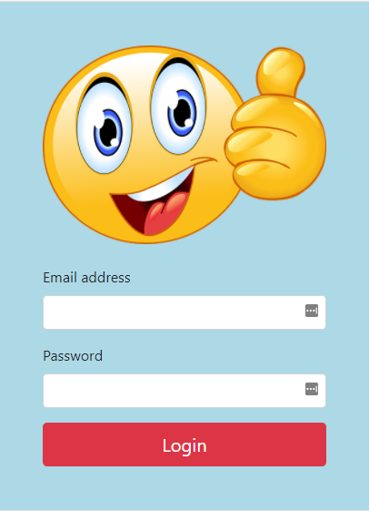

## Hide the Tenant Switch from the login page of an ABP Framework application

## Introduction

In this step-by-step guide I will explain how you can hide the tenant switch on the login page of an **ABP Framework** application.

The sample application has been developed with **Blazor** as UI framework and **SQL Server** as database provider.

### Source Code

The source code of the completed application is [available on GitHub](https://github.com/bartvanhoey/AbpHideTenantSwitchRepo).

## Requirements

The following tools are needed to run the solution.

* .NET 5.0 SDK
* VsCode, Visual Studio 2019 or another compatible IDE.

## Development

### Create a new ABP Framework Application

* Install or update the ABP CLI:

```bash
dotnet tool install -g Volo.Abp.Cli || dotnet tool update -g Volo.Abp.Cli
```

* Use the following ABP CLI command to create a new Blazor ABP application:

```bash
abp new AbpHideTenantSwitch -u blazor
```

### Open & Run the Application

* Open the solution in Visual Studio (or your favorite IDE).
* Run the `AbpHideTenantSwitch.DbMigrator` application to apply the migrations and seed the initial data.
* Run the `AbpHideTenantSwitch.HttpApi.Host` application to start the server side.
* Run the `AbpHideTenantSwitch.Blazor` application to start the Blazor UI project.

### Open HttpApi.Host.csproj and comment out the line below

``` html
    <!-- <PackageReference Include="Volo.Abp.AspNetCore.Mvc.UI.Theme.Basic" Version="4.4.3" /> -->
```

## Copy Volo.Abp.AspNetCore.Mvc.UI.Theme.Basic module to the src folder of your project

* Open a command prompt and clone the [apb repository](https://github.com/abpframework/abp) into your computer.

```bash
   git clone https://github.com/abpframework/abp
```

* Find module **Volo.Abp.AspNetCore.Mvc.UI.Theme.Basic**(abp/modules/basic-theme/src/...) in the ABP repo.
* Copy the module into your **src folder** of the project.

## Comment out and replace in the Volo.Abp.AspNetCore.Mvc.UI.Theme.Basic.csproj  

```html
    <!-- <Import Project="..\..\..\..\configureawait.props" /> -->
    <Import Project="..\..\common.props" />
```

## Comment out in Volo.Abp.AspNetCore.Mvc.UI.Theme.Basic.csproj

```html
  <!-- <ItemGroup>
    <ProjectReference Include="..\..\..\..\framework\src\Volo.Abp.AspNetCore.Mvc.UI.MultiTenancy\Volo.Abp.AspNetCore.Mvc.UI.MultiTenancy.csproj" />
    <ProjectReference Include="..\..\..\..\framework\src\Volo.Abp.AspNetCore.Mvc.UI.Theme.Shared\Volo.Abp.AspNetCore.Mvc.UI.Theme.Shared.csproj" />
  </ItemGroup> -->
```

## Open a command prompt in the Volo.Abp.AspNetCore.Mvc.UI.Theme.Basic and install packages

```bash
    abp add-package Volo.Abp.AspNetCore.Mvc.UI.MultiTenancy
    abp add-package Volo.Abp.AspNetCore.Mvc.UI.Theme.Shared
```

## Change Target DOTNET framework Volo.Abp.AspNetCore.Mvc.UI.Theme.Basic.csproj

```html
    <!-- <TargetFramework>net6.0</TargetFramework> -->
    <TargetFramework>net5.0</TargetFramework> 
```

## Open a command prompt in the Volo.Abp.AspNetCore.Mvc.UI.Theme.Basic and build

```bash
    dotnet build
```

## Add a reference to Volo.Abp.AspNetCore.Mvc.UI.Theme.Basic in the HttpApi.Host.csproj file

```bash
   dotnet add reference ../../src/Volo.Abp.AspNetCore.Mvc.UI.Theme.Basic/Volo.Abp.AspNetCore.Mvc.UI.Theme.Basic.csproj
```

## Open a command prompt in the HttpApiHost and build

```bash
    dotnet build
```

## Goto Volo.Abp.AspNetCore.Mvc.UI.Theme.Basic\Themes\Basic\Themes\Basic\Layouts\Account.cshtml

Comment out if statement below to hide Tenant Switch.

```html
@* @if (MultiTenancyOptions.Value.IsEnabled &&
                  (TenantResolveResultAccessor.Result?.AppliedResolvers?.Contains(CookieTenantResolveContributor.ContributorName) == true ||
                   TenantResolveResultAccessor.Result?.AppliedResolvers?.Contains(QueryStringTenantResolveContributor.ContributorName) == true))
                {
                    <div class="card shadow-sm rounded mb-3">
                        <div class="card-body px-5">
                            <div class="row">
                                <div class="col">
                                    <span style="font-size: .8em;" class="text-uppercase text-muted">@MultiTenancyStringLocalizer["Tenant"]</span><br />
                                    <h6 class="m-0 d-inline-block">
                                        @if (CurrentTenant.Id == null)
                                        {
                                            <span>
                                                @MultiTenancyStringLocalizer["NotSelected"]
                                            </span>
                                        }
                                        else
                                        {
                                            <strong>@(CurrentTenant.Name ?? CurrentTenant.Id.Value.ToString())</strong>
                                        }
                                    </h6>
                                </div>
                                <div class="col-auto">
                                    <a id="AbpTenantSwitchLink" href="javascript:;" class="btn btn-sm mt-3 btn-outline-primary">@MultiTenancyStringLocalizer["Switch"]</a>
                                </div>
                            </div>
                        </div>
                    </div>
                }

```

## Add method below right under the ConfigureServices method in the HttpApiHostModule class of the HttpApi.Host project

```csharp
// import using statements
private void ConfigureTenantResolver(ServiceConfigurationContext context, IConfiguration configuration)
{
    Configure<AbpTenantResolveOptions>(options =>
    {
        options.TenantResolvers.Clear();
        options.TenantResolvers.Add(new CurrentUserTenantResolveContributor());
});
}
```

## Call method CookieTenantResolveContributor from the ConfigureServices method

```csharp
public override void ConfigureServices(ServiceConfigurationContext context)
{
 // other code here ...
 
  ConfigureTenantResolver(context, configuration);
}
```

## Add a Pages/Account folder to HttpApi.Host project

## Add  a CustomLoginModel.cs class to the Account folder

```csharp
using System;
using System.Threading.Tasks;
using Microsoft.AspNetCore.Authentication;
using Microsoft.AspNetCore.Identity;
using Microsoft.AspNetCore.Mvc;
using Microsoft.Extensions.Options;
using Volo.Abp.Account.Web;
using Volo.Abp.Account.Web.Pages.Account;
using Volo.Abp.TenantManagement;
using IdentityUser = Volo.Abp.Identity.IdentityUser;

namespace AbpHideTenantSwitch.HttpApi.Host.Pages.Account
{
    public class CustomLoginModel : LoginModel
    {
        private readonly ITenantRepository _tenantRepository;

        public CustomLoginModel(IAuthenticationSchemeProvider schemeProvider, IOptions<AbpAccountOptions> accountOptions, IOptions<IdentityOptions> identityOptions, ITenantRepository tenantRepository) : base(schemeProvider, accountOptions, identityOptions)
        {
            _tenantRepository = tenantRepository;
        }

        public override async Task<IActionResult> OnPostAsync(string action)
        {
            var user = await FindUserAsync(LoginInput.UserNameOrEmailAddress);
            using (CurrentTenant.Change(user?.TenantId))
            {
                return await base.OnPostAsync(action);
            }
        }

        protected virtual async Task<IdentityUser> FindUserAsync(string uniqueUserNameOrEmailAddress)
        {
            IdentityUser user = null;
            using (CurrentTenant.Change(null))
            {
                user = await UserManager.FindByNameAsync(LoginInput.UserNameOrEmailAddress) ??
                       await UserManager.FindByEmailAsync(LoginInput.UserNameOrEmailAddress);

                if (user != null)
                {
                    return user;
                }
            }

            foreach (var tenant in await _tenantRepository.GetListAsync())
            {
                using (CurrentTenant.Change(tenant.Id))
                {
                    user = await UserManager.FindByNameAsync(LoginInput.UserNameOrEmailAddress) ??
                           await UserManager.FindByEmailAsync(LoginInput.UserNameOrEmailAddress);

                    if (user != null)
                    {
                        return user;
                    }
                }
            }

            return null;
        }
    }
}

```

## Add a Login.cshtml file to Account folder

```html
@page
@addTagHelper *, Microsoft.AspNetCore.Mvc.TagHelpers
@addTagHelper *, Volo.Abp.AspNetCore.Mvc.UI
@addTagHelper *, Volo.Abp.AspNetCore.Mvc.UI.Bootstrap
@addTagHelper *, Volo.Abp.AspNetCore.Mvc.UI.Bundling

@using Microsoft.AspNetCore.Mvc.Localization
@using Volo.Abp.Account.Localization
@using Volo.Abp.Account.Settings
@using Volo.Abp.Settings

@model AbpHideTenantSwitch.HttpApi.Host.Pages.Account.CustomLoginModel

@inject IHtmlLocalizer<AccountResource> L
@inject Volo.Abp.Settings.ISettingProvider SettingProvider

<div class="card text-center mt-3 shadow-sm rounded">
    <div class="card-body abp-background p-5">
        <div class="form-group">
            
        </div>
        @if (Model.EnableLocalLogin)
        {
            <form method="post" class="mt-4 text-left">
                <input asp-for="ReturnUrl" />
                <input asp-for="ReturnUrlHash" />
                <div class="form-group">
                    <label>Email address</label>
                    <input asp-for="LoginInput.UserNameOrEmailAddress" class="form-control" />
                    <span asp-validation-for="LoginInput.UserNameOrEmailAddress" class="text-danger"></span>
                </div>
                <div class="form-group">
                    <label asp-for="LoginInput.Password"></label>
                    <input asp-for="LoginInput.Password" class="form-control" />
                    <span asp-validation-for="LoginInput.Password" class="text-danger"></span>
                </div>
                <abp-button type="submit" button-type="Danger" name="Action" value="Login" class="btn-block btn-lg mt-3">@L["Login"]</abp-button>
                @if (Model.ShowCancelButton)
                {
                    <abp-button type="submit" button-type="Secondary" formnovalidate="formnovalidate" name="Action" value="Cancel" class="btn-block btn-lg mt-3">@L["Cancel"]</abp-button>
                }
            </form>
        }
    </div>
</div>
```

## add a file custom-login-styles.css to the wwwroot folder of the HttpApi.Host project

```html
.abp-background {
    background-color: yellow !important;
}

```

## Open file AbpHideTenantSwitchHttpApiHostModule.cs and add custom-login-styles.css to bundle

```csharp
private void ConfigureBundles()
   {
     Configure<AbpBundlingOptions>(options =>
     {
       options.StyleBundles.Configure(
                 BasicThemeBundles.Styles.Global,
                 bundle =>
             {
               bundle.AddFiles("/global-styles.css");
               bundle.AddFiles("/custom-login-styles.css");
             }
             );
     });
   }
```

## Add an Image

Add an **assets/images** folder to the **wwwroot** folder of the **HttpApi.Host** project and copy/paste the an image in the **images** folder.  

## Start both the Blazor and the HttpApi.Host project to run the application

Et voilà! This is the result. A Login page without a Tenant switch.



A user can now login without specifying the tenant name.

Get the [source code](https://github.com/bartvanhoey/AbpHideTenantSwitchRepo.git) on GitHub.

Enjoy and have fun!
